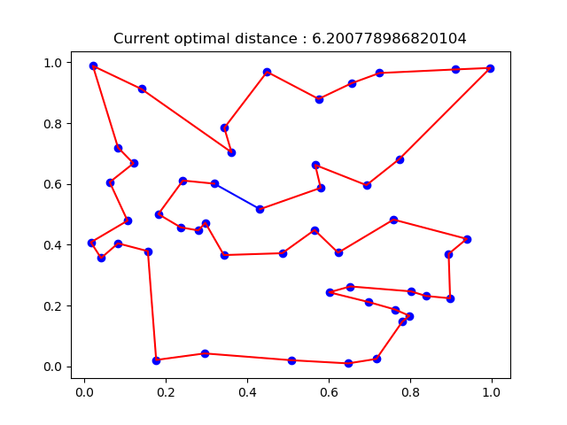
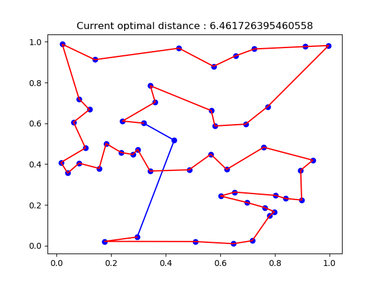

# ROD_oracle
Parametrized oracle for computing the ROD (ratio of optimal decisions). Implementation related to "How to Evaluate Machine Learning Approaches for Combinatorial Optimization: Application to the Travelling Salesman Problem"


## Requirements
Python 3.5+  
Numpy 1.15  
Scipy 1.1  
Matplotlib 3.0  
Tqdm

You will also need to install [Concorde](http://www.math.uwaterloo.ca/tsp/concorde.html) to use the oracle. To work with the code, the solver code must be downloaded and placed at the project root. After compiling it, the executable for the TSP concorde solver should be found at `./concorde/TSP/concorde` if you are located at the project root.

Note for macOs users: you can install Concorde using [these instructions](https://qmha.wordpress.com/2015/08/20/installing-concorde-on-mac-os-x/).

## Function and usage

This code can be used to compute optimality gaps from the oracle algorithm we introduced. The basic way to call it is :
```
python oracle.py \
--data example/tspmini50_test_concorde.txt \
```
This will compute optimality gaps for the oracle with a precision range starting at 0, ending at 1 and increasing of 0.01 at every step.

You can ask for a specific range of values, for instance

```
python oracle.py \
--data example/tspmini50_test_concorde.txt \
--min_prec 0.9 \
--max_prec 0.92 \
--prec_step 0.05
```

There is also a possibility to visualize the evolution of the construction by using the `--display` flag.

## How does this work in practice ?

Most of the code is pretty straightforward : we compute the optimality gap for every precision value.  
On each graph, the solution is constructed iteratively. The oracle decides at each step of the next vertex to visit. If it does not make an optimal choice, the optimal tour including the new partially constructed solution has to be computed.  

This problem is equivalent to finding the shortest hamiltonian path between the extremities of the partial solution, considering only the nodes that haven't been visited yet. We can see below an example where the hamiltonian path (in red) is recomputed following the non optimal choice by the oracle.  

Before             |  After
:-------------------------:|:-------------------------:
  |  

This can be reformulated into a Traveling Salesman Problem, by adding a dummy vertex which is at distance 0 of the extremities and infinity from the others. This problem is solved in our code with the help of the Concorde solver.  

## File format

You can provide your own graphs, the data file has to present one instance per line, with each composed this way :
```
x_1, y_1, x_2, y_2, ..., x_n, y_n
```
with (x_i,y_i) being the 2D coordinates of the i-th point in the graph, and n the number of nodes.  
Files in the `example` directory can provide you examples.
